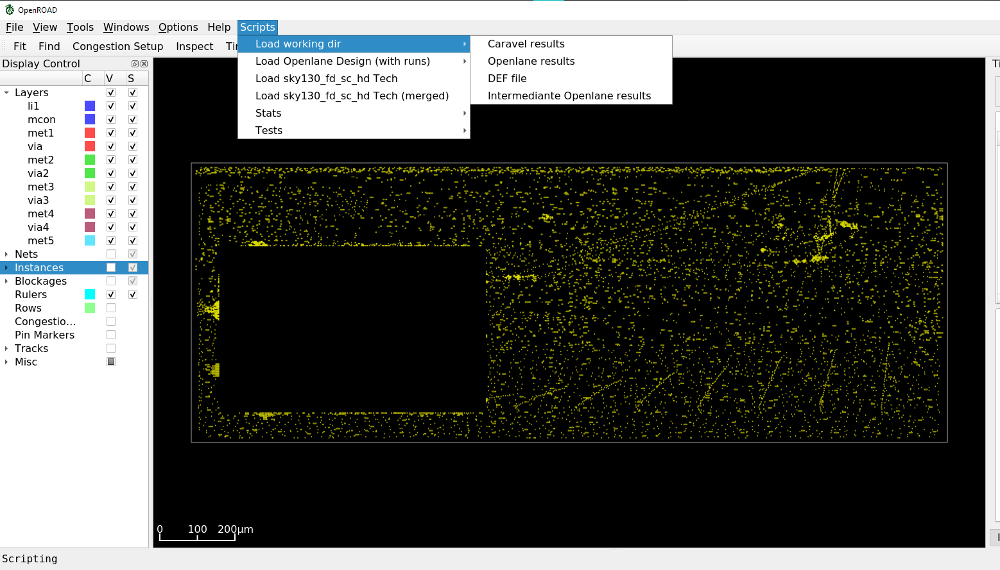

## This is a compilation of some useful [OpenROAD](https://github.com/The-OpenROAD-Project/OpenROAD) scripts I've been using for the GUI




---
### Setup
  
- Clone the repository to some local folder (ej: /home/user/openroad_useful_scripts )
- Set the `OPENROAD_SCRIPTS_PATH` environment variable to the local [scripts/](scripts/) folder (ej: `export OPENROAD_SCRIPTS_PATH=/home/user/openroad_useful_scripts/scripts` )
- Copy and rename the file [openroad-home_folder_script](openroad-home_folder_script) to `~/.openroad`
- `OPENLANE_ROOT` and `PDK_ROOT` environment variables should point to the appropriate dirs for most of the scripts to work 
- Launch `openroad -gui` 
- You can find the loaded scripts on the Scripts menu of the app

---

### Info about startup script

When OpenROAD starts it tries to load the `.openroad` file in your home folder. 

The provided `openroad-home_folder_script` startup script will **execute all the scripts** in the `[OPENROAD_SCRIPTS_PATH]` dir when openroad GUI opens. 

Some scripts are helper functions and other are the scripts that create the menu items (using `create_menu_item`)

If you prefer to hard-code the menu items instead of automatically load all the files you should create your own .openroad file and add the items you wish.

If you want to add another menu options you should add another file to the [scripts/menus/](scripts/menus/) folder. Ej:  

```
create_menu_item  -path "Scripts/Load working dir" -text "Caravel results" -script {
	load_caravel_result
}	
```

You can read more about the OpenROAD create_menu_item function at https://openroad.readthedocs.io/en/latest/main/src/gui/README.html#add-items-to-the-menubar


